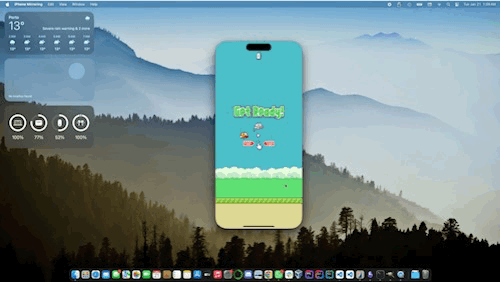

# BirdieSwiftie

BirdieSwiftie is a Swift implementation of the classic Flappy Bird game. While it strives to mimic the original, there are some minor differences.

## Objective

The goal of the game is to achieve the highest possible score by dodging incoming pipes.

Gameplay
The game is simple and intuitive. Here's how to control the bird:

Fly Higher: Tap the screen rapidly.
Fly Lower: Reduce your tapping frequency.
Maintain Altitude: Tap at a steady, consistent rate.
Currently, the game offers only one difficulty level.
